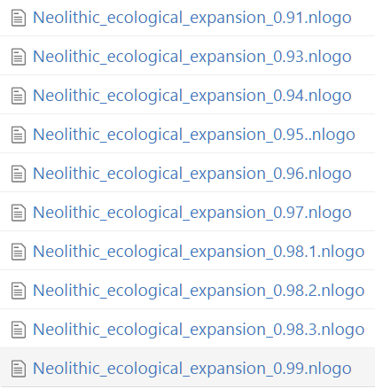
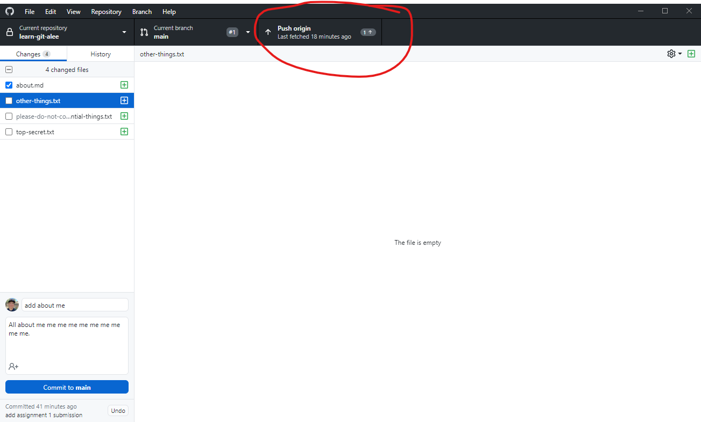
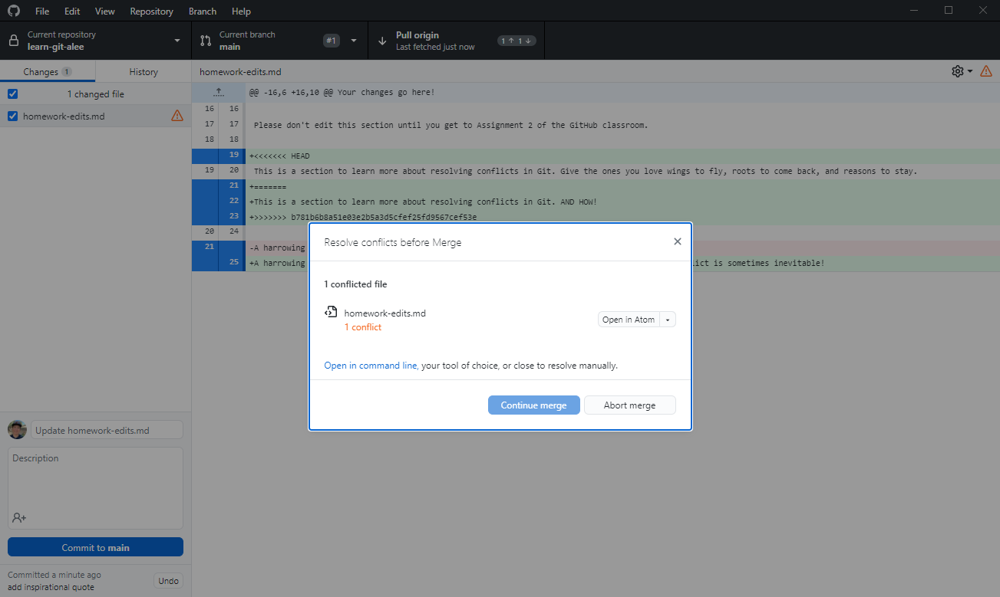
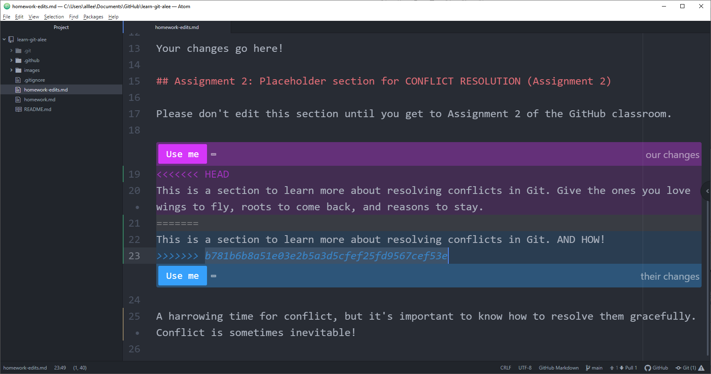
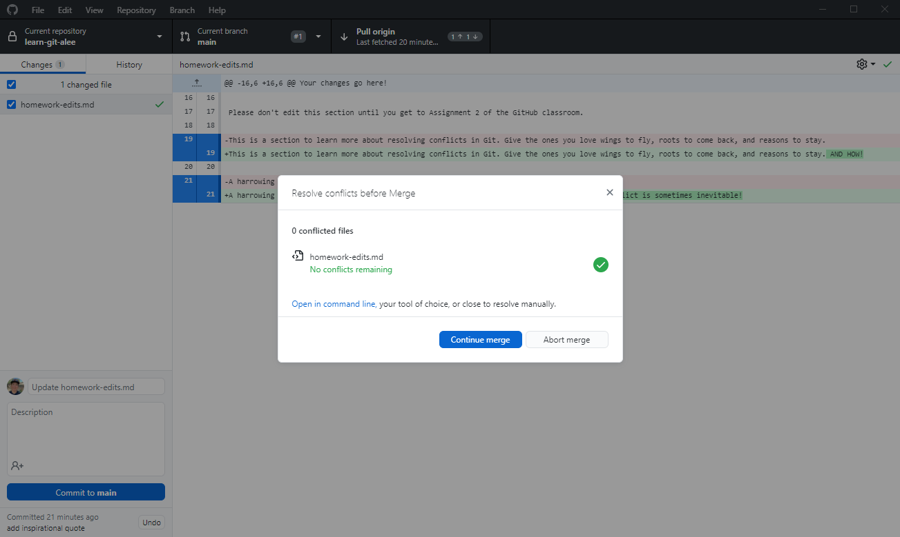
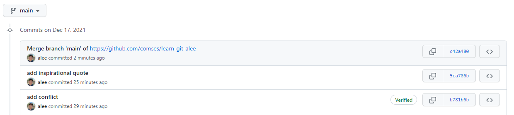
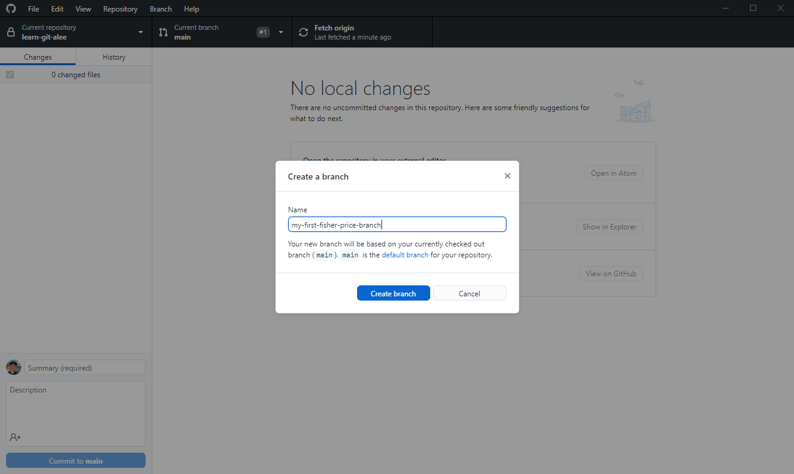
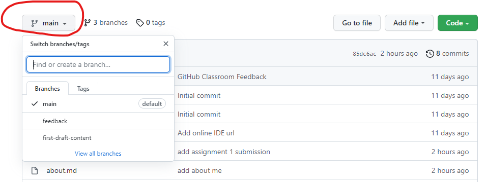
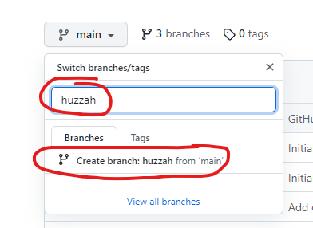

# :wave: The Basics of Git and GitHub

## 🤓 Course overview and learning outcomes 

This course is intended to be a condensed, comprehensive-enough introduction to version control systems, Git and GitHub. It is intended for people with little to no experience with either. 

We would like to get a sense of how long it takes to go through this training module as well as gather feedback on what worked and what didn't. If you'd like to contribute to these efforts, please [post your experiences on our Education Forums](https://forum.comses.net/c/education/28). This is an initial pilot of the course based on several years of teaching it to a live audience, and there's still a lot of room for improvement.


_from [XKCD](https://xkcd.com/1597/)_

### Objectives

- develop a clear conceptual model for *What are version control systems and why should I use them? What is Git and how do I use it?*
- gain familiarity with the GitHub web interface: edit files, clone and fork repositories, manage branches and pull requests, and resolve merge conflicts
- practice basic git workflows - this particular course focuses on GUI clients like [GitHub Desktop](https://desktop.github.com) or integrated development environments like [VS Code](https://code.visualstudio.com) or [Atom](https://atom.io/) to interact with your local and remote Git repositories 

We also maintain a [list of additional resources](#additional-resources-) that we've found useful over the years - please feel free to edit / update these! 🚀

## :octocat: Git and GitHub

Git is a **distributed Version Control System (VCS)**.

A **version control system** is a software tool that helps you **track changes to a set of files**. These can be any kinds of files: cat pictures, movies, plain-text source code files, CSVs, NetCDF files, shapefiles, zipfiles, tarballs, Word documents, PDFs, etc. 

To get started, you've got to tell the version control system which files you want to keep track of: let's say the NetLogo model, `boids.nlogo` and a `README.md` file that describes and documents the model. This is the _initial_ version of your files. Whenever you make subsequent changes to your tracked file(s), you tell the version control system, _"Hey! Keep track of the current state of this file now."_ and it will efficiently store the difference between the current state of the file and the previous state of the file from the last time you told the version control system, _"Hey! Keep track of the current state of this file."_. This previous state could be the _initial_ version or any subsequent version. For simplicity you can think of it as v1, v2, v3, v4, etc.

Most of the time we want to keep track of **plain-text files** in version control systems, like source code, configuration files and scripts. It's also OK to store binary files in Git as well like images, zipfiles, or any other files containing binary (i.e., non plain-text) data.

However, **you should avoid** putting *generated* files into Git like compiled executables (e.g. Windows .exe, macOS application bundles, Linux ELF executables), compiled C object files or Java .class files. These files are *derivatives* and change when their source material changes. They also tend to stop working as the host operating system or language runtimes and dependencies evolve. Instead, we recommend that you only put *source material* into Git, the things used to **create** the derivative. Put the **recipe** into Git, not the **cake**! So, instead of committing the 10 TBs of raw data you generated to create a hauntingly evocative figure for your publication, commit the code, documentation, and permanent identifiers / references to the related research objects used to generate that data + figure. You probably **should include the figures if they are not too large** - even though they are generated, it's always a good idea to have a succinct visual reference for what your model does.

_NOTE: handling large-scale, multi-dimensional ABM data outputs is an ongoing challenge, best left to data repositories like Figshare, the Open Science Framework, Dataverse, etc., **not** source code repositories like Git or the CoMSES Model Library!_

For more information on domain specific repositories and guidance from Nature Scientific Data, please see https://www.nature.com/sdata/policies/repositories

### Why do we need version control systems?

If you've ever had to collaborate with others on a paper or team coding project, you may have experienced something like this:


or this:



These are typical ad-hoc filename based versioning systems where the name of the file gets changed every time some changes are made (of course, there's no guarantee that changes were made, right? You can change a filename at any time). 

What's lacking from this type of versioning? Short answer: lots of context. What changes were made? Who made them? When were they made? Why were they made?

Git helps you and your team maintain a clean record of work - which files changed, what were the changes, when did they occur, and why were they made. It also helps you easily switch between versions so you can always get back to that Last Known Good Setup that you had before you began tinkering or experimenting with something new, and it helps you experiment with new things or maintain existing code over time with _branches_, allowing you to maintain and preserve multiple views over your codebase concurrently.

Git and GitHub can help you transparently document and preserve the provenance of your scientific code. *What changes were made, when, from whom, and why* can all be reliably stored and made accessible by Git, facilitating future comprehension and reuse. However, a clean Git history that clearly demonstrates the evolving life of a piece of scientific code requires discipline and maintenance, like keeping a house clean or maintaining a garden.

GitHub is a way to use the power of Git online with an "easy-to-use" web interface. It’s widely used in the software world and beyond to collaborate and maintain the history of projects.

## Key Concepts

Let's define some common terms you'll find in Git and GitHub.

### Repositories

A repository is where your project work happens -- it is the _root project_ folder with all your project’s files: source code, documentation, configuration files, input data files, data analysis scripts, images, etc. To start working with a Git repository, you can [clone it](#clone-a-repository), which downloads a local copy of the Git repository to the computer where you issued the `clone` request.

Repositories can be `local` (on your desktop or laptop) or `remote` (e.g., stored in the cloud ☁️  on GitHub, GitLab, BitBucket, etc).

GitHub repositories can contain a **README** plain text file in Markdown format. Every directory in your Git repository on GitHub will display its README when you view that directory on GitHub - here's [NetLogo's README](https://github.com/netlogo/netlogo#netlogo) and [the Julia language repository's README](https://github.com/JuliaLang/julia#the-julia-language). READMEs are a convenient and useful way to describe the contents of a directory in your GitHub repository - its purpose and any additional context you think would be helpful for someone laboring to understand your codebase in the future, including your future self.

At a minimum it's good practice to add a README file to your repository's root directory to explain why your project is useful, what others can do with your project, and how they can use it. This file that you're reading right now is a README to show how to learn Git and GitHub ♻.

To learn more about repositories read ["Creating, Cloning, and Archiving Repositories"](https://docs.github.com/en/github/creating-cloning-and-archiving-repositories/about-repositories) and ["About README's"](https://docs.github.com/en/github/creating-cloning-and-archiving-repositories/about-readmes). 

#### Advanced

A cloned Git repository has all the files and directories that Git was told to track along with an additional `.git` directory that lives in the repository's root directory. This `.git` directory contains all the magic Git book-keeping and metadata things that capture:

1. which actual file level changes occurred to the files
2. when were the changes recorded?
3. who recorded the changes
4. why were the changes made _(these last two parts you have to fill in yourself, Git's not THAT smart!)_

Whenever you are doing Git things (i.e., executing Git commands) you're using a Git client to interact with the stuff inside the managed `.git` directory that makes its relative root directory a special Git repository.

### Clone a repository

When a repository is created on GitHub (i.e., you click on the "New" button from your GitHub dashboard or the "Repositories" tab in your GitHub profile), it’s stored remotely in the cloud ☁️. You can **clone this repository** to create a local copy on your computer and then use Git to keep the two repositories synced. 

Working on a local repository makes it easier to work on new features, fix bugs, and organize your commits into logical, coherent sets of changes. When you **clone a repository**, downloading it to your local computer, you can use your favorite text editor instead of the GitHub web UI to edit and modify these files. Some popular text editors include [VS Code](https://code.visualstudio.com/), [Atom](https://atom.io/) or in our case, programming platforms like NetLogo. 

Cloning a repository from GitHub creates an exact replica of the Git repository that GitHub is managing, which includes the entire history of the Git repository. This is what makes Git a **distributed** version control system. You can switch to any version of any file recorded in your Git repository and view the history of changes that happened to that file, a fully provenanced graph of changes.

It's very important  the difference between **local** and **remote** repositories. **Local** repositories exist on the filesystem of the computer you're directly interacting with and **remote** repositories are exist somewhere accessible on the network, e.g., GitHub.com, GitLab.com or bitbucket.org.

To learn more about cloning, read ["Cloning a Repository"](https://docs.github.com/en/github/creating-cloning-and-archiving-repositories/cloning-a-repository). 

### Assignment 0

Please clone **this** repository now. In [GitHub Desktop](https://desktop.github.com), access the menu options `File -> Clone` repository (or <kbd>Ctrl</kbd> + <kbd>Shift</kbd> + <kbd>O</kbd> on Windows) and enter the URL from the Code button on GitHub - it should be something like `https://github.com/comses/learn-git-<your-github-username>`.


On GitHub Desktop you should see something like this:


Take note of where your local Git repository is going to be saved, this is the `Local path` shown here:


### Commit and push

When you tell Git to **commit** something you are asking it to take a snapshot of the changes you've made to a file or collection of files. As you gain more experience with Git you may hear the term "Directed Acyclic Graph" as in ["Git is a Directed Acylic Graph of commit objects"](https://medium.com/girl-writes-code/git-is-a-directed-acyclic-graph-and-what-the-heck-does-that-mean-b6c8dec65059). So what does that actually mean?


_image from https://www.oreilly.com/library/view/git-pocket-guide/9781449327507/ch01.html#fig0101_

Git stores its version control metadata in a graph data structure; a graph just like your social network graph. This graph data structure contains all the changes that have been made to the files in the repository, representing a one-way history like [time itself](https://quoteinvestigator.com/2015/09/16/history/). Each of the nodes in that graph you see above is a Git _commit object_.

These _commit objects_ are data structures with snapshots of your Git repository at the time that Git was asked to create a _commit object_. What kinds of things do you think a Git _commit object_ might need to keep track of?

1. the **files that changed**: The files that you explicitly tell Git to take a snapshot of and track in this commit
2. a **parent**: Every commit data object keeps track of its parent commit(s). This is the _Directed_ part of the Directed Acyclic Graph. What's the only commit in a Git repository that doesn't have a parent? Are there any commits that can have more than one parent?
3. **provenance**: a commit log message that you write to explain the commit, the git username and email of the commit's author
4. a **unique hash ID**: you'll see these often on GitHub as long strings like `fde99eeb73f2426769fe02b5508b0ebf08514f2d` - these hash IDs uniquely identify a commit in a Git repository and used to track a given Git commit's parent(s).

In summary, a Git repository is a _graph_ of commit objects, where each commit object points to its parent commit(s). That's where the directed part of the graph comes in. Acyclic means that you can't have any loops in the graph (i.e., commits always gaze up at their ancestors). The very first root commit has no parents, and _merge commits_ have two or more parents.

#### Good practices for commits

It's a good rule of thumb to keep commits small and self contained - a bug fix along with a test that exposes the bug deserves a commit to capture just those changes. This makes it easier to follow a project's history over time and understand what changes were made where and why.

If I fix a bug, add a feature, refactor the underlying implementation of a given function, and rename some variables in a module all within the same commit it makes it MUCH harder to identify what was done where and why. It also makes it hard to correlate changes in observed program behavior to changes in the code - it could have been any of those changes! Furthermore, if I made a mistake in any of those changes or end up changing my mind about how I wanted to rename that variable, Git can no longer help me easily revert those changes - I have to either revert all of them or manually apply the next set of changes.

So it's a good rule of thumb to break up each set of coherent changes into multiple commits, where one commit corresponds to a *coherent* set of changes. In general, small and localized commits are easier to understand and reason about. Of course, rules are meant to be broken, so don't sweat it if you end up having a large, sprawling commit. Just strive for small, self-contained, and semantically sensible commits - you'll thank yourself later!

NOTE: when you commit your work **locally**, into your **local repository** it doesn't automatically go to your remote repository on GitHub.com. You'll still need to **push** your work to GitHub.com or other remote repository for those commits to be synchronized with that remote. If you made the commit on GitHub.com through its native web editor there is no need to push - the commit goes directly into that remote repository.

### Fetch and Pull

Fetch and pull are how you synchronize changes between two repositories - in our case, we're usually thinking about how to grab changes from a remote repository and apply them to our local repository to make it up-to-date.

Fetch synchronizes the state of the `.git` magic metadata directory **without modifying the actual files in the repository directory**. For example, let's say that we had cloned our repository with our `boids.nlogo` NetLogo model in it 7 days ago and then went on vacation. While on vacation, our hard-working and reliable collaborators made lots of changes to the `boids.nlogo` model, adding all kinds of new features and fixing bugs, etc. To get their changes into our local 7 days old repository, we would first issue a _fetch_ but this won't actually change that `boids.nlogo` file just yet. The contents of `boids.nlogo` will only change when you tell Git to _pull_ the changes into your local repository.

### Assignment 1

We will complete four tasks in this assignment:

1. make changes to an existing file in this repository, `homework-edits.md`
2. add a new file with the GitHub web interface, named `add-github-web.md`
3. add a new file to your local repository using GitHub Desktop named `about.md`
4. view your commit history on GitHub after making these changes to make sense of your repository

The contents of these files should be valid GitHub markdown - experiment with the syntax and feel free to add any text you like. Your files should have at least the following types of Markdown content (across all of the files):

* headers
* a numbered list
* a bulleted list
* at least one hyperlink / URL to a web resource (whatever you like, something interesting to share with the rest of the class, but nothing inappropriate please!)

#### Using Markdown on GitHub 

You might have noticed already, but you can add styling to your issues, pull requests, and files. ["Markdown"](https://guides.github.com/features/mastering-markdown/) is an easy way to style your issues, pull requests, and files with some simple syntax. This can be helpful to organize your information and make it easier for others to read. You can also drop in gifs, images, and emojis to help convey your ideas!

To learn more about using GitHub’s flavor of markdown, read ["Basic Writing and Formatting Syntax"](https://docs.github.com/en/github/writing-on-github/basic-writing-and-formatting-syntax). 

#### Task 1. Edit an existing file

First, let's make some changes to a file that already exists in this repository. You should have already cloned this repository in [assignment 0](#assignment-0). Let's make modifications to the file, `homework-edits.md`, in this repository.

1. locate `homework-edits.md` on your local filesystem
2. open it in a text editor (e.g., Atom, VS Code)
3. make some changes to the file using valid Markdown and save them. Add a link to your work, write a poem. Feel free to be creative!

Now, record the commit. After making changes to the files it's time to return to GitHub Desktop to commit these changes. 


Enter a log summary and descriptive message to remind your future self and collaborators what you did and why.

Your log summary message should be short and to the point, an executive summary of the changes you made and typically limited to 50 characters. They are typically recorded in a present tense, action verb oriented style, e.g., `fix overflow bug in random number generator`.

The larger Description text box is the best place to include all relevant non-obvious details that would be difficult to glean from the code itself like an electronic lab notebook. It can be as long as needed.

When you are finished with your commit log messages and double checked that only the files you want to commit are checked in the window, click the "Commit" button.

Are these changes now visible on your repository at GitHub.com? Refresh the remote GitHub repository and see if the file is there.

The answer is no - we only recorded this change on our **local** Git repository. Our remote repository on GitHub is still unchanged and will remain so until we **push** our changes to GitHub.



Do that by clicking on the `Push origin` button shown here. Now when you refresh your GitHub repository you should see the changes there.

#### Task 2. Create a new file: GitHub Web Interface

Create a new file named `add-github-web.md` through the GitHub web interface following [these instructions](https://docs.github.com/en/repositories/working-with-files/managing-files/creating-new-files).

We just created a new file on our **remote** GitHub repository. But these changes do not exist on our local repository; GitHub Desktop is not like Dropbox and does not automatically synchronize.

To bring our **remote** changes over to our **local** GitHub repository we'll need to _fetch_ and _pull_ those changes in GitHub Desktop.

First, _fetch_ all changes from the **remote** GitHub repository by clicking this button on GitHub Desktop:


Fetch doesn't change the state of your actual filesystem, it just grabs all the changes that were made and updates the magic `.git` directory. You can verify this by going into your repository and check - is the file there?

In order to apply those changes to our actual filesystem, we need to *pull* them. You should see something like this:


Click on the `Pull origin` button to bring the new file that you *fetch*ed from your remote git repository into your local git repository into your active filesystem.

Remember to fetch and pull frequently, whenever you know there are remote changes that you need to pull into your local repository. It's a good idea to do it before every coding session and sometimes during your coding sessions as you coordinate with your team.

#### Task 3. Create a new file: GitHub Desktop

Create a new file named `about.md` in your local repository folder. On Windows you can use the Repository menu item `Repository -> Show in Explorer` to go to your local repository folder. Once you've added some text to this file you will see it in your GitHub Desktop UI under the `Changes` tab. 

Check or uncheck the checkboxes to mark which files are to be included in this commit so be sure that you are _only including the files you want to commit_. By default GitHub Desktop checks all new files it finds in the GitHub repository folder that it is currently managing, so you might need to uncheck them if you don't want them getting sent to your remote GitHub repository. 


On the command line, this is a 2-phase process. First you **add** files to your commit, telling git that you want to keep track of these files, then you **commit** them, formally marking them as part of your commit and associating a commit log message with that _changeset_.

After you've committed your changes, the middle button in GitHub Desktop will change to `Push origin` and let you **push** your commits to the **remote** GitHub repository. Refresh your remote GitHub repository after you push and you'll see your changes there!


#### Task 4. View your commit history

Let's take a look at what our commit history looks like on GitHub. Go back to your **remote repository** on GitHub, click on the `< > Code` tab, and click on the `commits` link at the top right of the little table next to the repository:


Click through each of the commits there and you should see all the changes that happened within that commit. The commit history is **extremely useful** for understanding what happened in a codebase.

### Summary: tl;dr;ddaw

Use **commit** and **push** to share your changes with a remote repository so your teammates and collaborators can see your latest work. Use **fetch** and **pull** to grab changes from a remote repository so you can view your collaborators latest work.

## Managing Contributions: Conflicts, Merging, Branching, and Pull Requests

### Conflicts

So far we've handled mostly linear changes where all **commits** and **pushes** were performed on two fully synchronized local and remote repositories. But what happens if you make a change to a file, commit that change, and at the same exact time (or close to it), your collaborator Alice commits and pushes their changes to the same file? There's two scenarios we'll cover here.

If Alice made changes to an unrelated area of the same file that you made changes to, Git is smart enough to notice that these changes are _independent_ of each other and will happily combine them with a _merge commit_. For example, if you only changed line 5 of `boids.nlogo` and Alice only changed lines 37-42 of `boids.nlogo`, Git will zip those changes together without asking you for input.

However, if you changed text in line 5 of `boids.nlogo` AND changed text in lines 39-41 of `boids.nlogo` while Alice also changed lines 37-42, well we have a problem! Which changes should Git keep? Git doesn't know, and will ask you to figure it out and tell it what to do using a standard "conflict" format that looks something like this (pulled shamelessly from Atlassian's excellent Git tutorial at https://www.atlassian.com/git/tutorials/using-branches/merge-conflicts):

```
<<<<<<< HEAD
this is some content to mess with
content to append
=======
totally different content to merge later
>>>>>>> b781b6b8a51e03e2b5a3d5cfef25fd9567cef53e
```

We can see some strange new additions

```
<<<<<<< HEAD
=======
>>>>>>> b781b6b8a51e03e2b5a3d5cfef25fd9567cef53e
```

Think of these new lines as "conflict dividers". The `=======` line is the "center" of the conflict. All the content between the  `<<<<<<< HEAD` line and the center line is content that exists in your **local** repository - usually this is YOUR stuff, your changes. All the content between the center `========` and `>>>>>>> b781b6b8a51e03e2b5a3d5cfef25fd9567cef53e` is content that is present in the **remote repository**, the changes that you want to bring in.

If you have multiple conflicts, you may have multiple conflict sections like this in multiple files, they will all start with `<<<<<<< HEAD` and end in a `>>>>>> a-very-long-hash-or-maybe-a-branch-name-but-we-havent-learned-about-branches-yet`. You should make sure you've resolved ALL conflicts before committing and pushing your work back up to your remote GitHub repository.

As it stands, if we have local conflicts to resolve and we try to push our changes to GitHub, GitHub will refuse and tell you that you have encountered a merge conflict. So let's set that up for ourselves and see how to resolve them.

### Assignment 2

In order to generate a merge conflict by ourselves we'll do something similar to Assignment 1, where we edit and commit a file in the GitHub web interface, and edit and commit the same file in our local repository using GitHub Desktop. The difference is that we will NOT synchronize the local repository using _fetch_ and _pull_ before committing in GitHub Desktop.

To learn how to edit a file in the GitHub web interface, please [read here](https://docs.github.com/en/repositories/working-with-files/managing-files/editing-files).

1. Edit the file [`homework-edits.md`](homework-edits.md) in this repository using the [_GitHub Web interface_](https://docs.github.com/en/repositories/working-with-files/managing-files/editing-files), and go to the Assignment 2 section of that file. Edit the line `A harrowing time for conflict, but it's important to know how to resolve them gracefully.` and add another sentence at the end of that period. Add anything you like, an inspirational quote, a demotivational mantra, a list of your favorite or most used emojis, etc.
2. Commit your changes via the GitHub web interface - don't forget to add a commit log message explaining why you chose what you did!
3. Go back to GitHub Desktop and open `homework-edits.md` in your **local repository** with your local text editor (e.g., Atom, VS Code, Notepad, TextEdit, etc). Make sure you **do not** click the _Fetch origin_ button or you'll have to repeat step 1.
4. Edit the same exact line `A harrowing time for conflict, but it's important to know how to resolve them gracefully.` and add some different text at the end of that sentence (or replace it entirely for something completely different).
5. After saving the file, go back to GitHub Desktop, and commit your changes there as well. Now, try to **push** those changes back up to GitHub. You should see something like this:


GitHub Desktop is telling us that there are newer commits on remote that we haven't synchronized with, and that we need to reconcile the two repositories before we can get our changes back up to GitHub. Click on the blue buttons in GitHub Desktop to continue and `Fetch` and `Pull` those changes into your local repository. Once you've **pull**ed the changes into your local repository, you should be presented with this screen:



At this point I have the option to open the conflicting file in Atom, my configured GitHub Desktop text editor, and so I'll do that and resolve the conflict. Atom and other IDEs will sometimes present a convenience option like the following:



Here you can simply select the differently colored `Use me` buttons to directly choose one version of the text or the other but sometimes you **don't want to throw away what's being merged**. However, if you do know that you don't need one version, this is a convenient way to accept one change wholesale vs another change.

Instead, manually delete the `<<<<<`, `=====`, and `>>>>>>` lines and integrate the text to make it how you want the final output to look. Once you've completed that and saved the file, you should see something like this in GitHub Desktop:



Go ahead and click the `Continue merge` button, and then **push** your changes back to the origin (our **remote** repository on GitHub). Now if you return to GitHub in your browser and view your commit history you should see something like this:



Click on the merge commit and its two preceding commits to see the history of the changes that were made. This special _merge commit_ has two parents, not one as most commits do. Does what Git did make sense?

Congratulations, you've successfully resolved a merge conflict!

### Branches

You can use branches on GitHub to isolate work that you do not want merged into your final project just yet. Branches allow you to develop features, fix bugs, or safely experiment with new ideas in a contained area of your repository. Typically you will create a new branch from the default branch of your repository, which is usually called `main`. This makes a new working copy of your `main` branch that you can experiment with. Once your new changes have been reviewed by a teammate, or you are satisfied with them, you can merge your changes into the default branch of your repository. Or you can delete the branch if you decided it was a failed experiment.

Key point: branches are always `based` on an existing branch, usually the default branch. A new branch carries all of the previous Git history of the branch it was based on and starts a new Git history from that point forward, kind of like a tree branch emerging from a tree trunk. Branches can and do evolve independently of each other. Changes you make in a branch `islanders` are not going to be visible in changes made in a different branch `rangers` even though they may share some history together.

To learn more about branching, read ["About Branches"](https://docs.github.com/en/github/collaborating-with-issues-and-pull-requests/about-branches).

### Forks
A fork is another way to copy a repository, but is usually used when you want to contribute to someone else’s project. Forking a repository allows you to freely experiment with changes without affecting the original project and is a common way to contribute to open source software projects.

To learn more about forking, read ["Fork a repo"](https://docs.github.com/en/github/getting-started-with-github/fork-a-repo)

### Pull requests
When working with branches, you can use a pull request to tell others about the changes you want to make and ask for their feedback. Once a pull request is opened, you can discuss and review the potential changes with collaborators and add more changes if need be. You can add specific people as reviewers of your pull request which shows you want their feedback on your changes. Once a pull request is ready-to-go, it can be merged into your main branch.

To learn more about pull requests, read ["About Pull Requests"](https://docs.github.com/en/github/collaborating-with-issues-and-pull-requests/about-pull-requests). 

### Assignment 3

Create a branch through GitHub Desktop and on the GitHub web interface. Name the branch you create in GitHub Desktop `gh-desktop` and the GitHub web branch `gh-web`. 

#### Branching in GitHub Desktop 

You can create a branch in GitHub Desktop by clicking on the `Current branch` button in the middle between the `Current repository` and the `Fetch origin` / `Pull origin` / `Push origin` button (we'll call that rightmost button the `Synchronize` button from now on).


You'll need to name the branch and decide where it should be based on. If you were not on the default branch when you click the `New branch` button, you might get a different dialog asking you if you want to base the new branch off the default branch or the current branch you are on.



Depending on the state of your local Git repository an additional dialog may pop up asking you if you want to `Leave my changes on ...` or `Bring my changes into ...`. This means you had uncommitted / unpushed changes in your local repository and GitHub Desktop wants to know what you want to do with those changes. Leaving the changes puts them into a **stash** where you can retrieve the changes later when you want them. Bringing the changes with you makes the new branch you are creating have the file changes right there to commit / push when you are ready.

When you are done creating the branch, you'll still need to **push** it to GitHub.com - click the `Synchronize` button that should now have the label `Publish branch`. This only appears if the branch does not already exist to GitHub, otherwise it'll be one of the usual `Fetch origin` / `Pull origin` / `Push origin` labels. 

After you publish the branch to GitHub the label should change back to `Fetch origin`.

#### Branching in the GitHub web interface

Creating a branch on GitHub removes the need to `push` the changes to GitHub since it's right there!

First, click on the `branch` button 



Next, type the name of the branch you want to create and then click the `Create branch: <branchname>` link below it. 

Make sure you are creating the branch based on the correct branch. Most of the time this will be the default `main` branch, but sometimes you may want to branch off of someone else's branch. It's branches all the way down!



Huzzah! Your branch is now created and live.

Now that you have created a new branch, please find a NetLogo model to add to this branch and add information about the model in a documentation file.

You can find a model of your choice from the [Netlogo Modeling Commons](http://modelingcommons.org/) or from the [CoMSES.Net Computational Model Library](https://www.comses.net/). Find a model that is related to your own interests! 

Once you have chosen and downloaded a Netlogo model, save the file to your local Github repository branch that you created.

As you may have already learned in the [Responsible Practices for Scientific Software Training Module](https://www.comses.net/education/responsible-practices/), code should always have documentation. Let's add some documentation to accompany your Netlogo model. 

Copy information about the model to a plain text document. The information can be the description stored in the `Info` tab in the Netlogo model. Or it can be the description that accompanied the model in its online archive.

Use a text editor to create a file named `documentation.md` and paste the model description into it. 

You should now have a NetLogo model and a documentation file in your repository. Don't forget to **commit** them with clear and cogent commit log messages (and include a citation or permanent URL to the model) and **push** them back to GitHub!

### Issues
Issues are a way to track enhancements, tasks, or bugs for your work on GitHub. Issues are a great way to keep track of all the tasks you want to work on for your project and let others know what you plan to work on. You can also use issues to tell a favorite open source project about a bug you found or a feature you think would be great to add.

For larger projects, you can keep track of many issues on a project board. GitHub Projects help you organize and prioritize your work and you can read more about them [in this "About Project Boards" document](https://docs.github.com/en/github/managing-your-work-on-github/about-project-boards). You likely won’t need a project board for your assignments, but once you move on to even bigger projects, they’re a great way to organize your team’s work.

You can also link together pull requests and issues to show that a fix is in progress and to automatically close the issue when someone merges the pull request.

To learn more about issues and linking them to your pull requests, read ["About Issues"](https://docs.github.com/en/github/managing-your-work-on-github/about-issues). 

### Your user profile

Your profile page tells people the story of your work through the repositories you're interested in, the contributions you've made, and the conversations you've had. You can also give the world a unique view into who you are with your profile README. You can use your profile to let future employers know all about you! 
To learn more about your user profile and adding and updating your profile README, read ["Managing Your Profile README"](https://docs.github.com/en/github/setting-up-and-managing-your-github-profile/managing-your-profile-readme). 


### Beginners Git Workflow

Now that we have some basic terminology for Git and GitHub under our belt we can start to go into typical workflows for
how we can use Git to manage changes to our files. 

The simplest Git workflow is to have a single committer, you, commit and push all of your changes to your local
repository and synchronize that with GitHub. 

0. Have a Git repository cloned on your local computer e.g., `C:\Users\my-username\GitHub\my-first-fisher-price-git-repository`
1. Make some changes to your files in your git repository
2. (Alternatively, you can also make changes to your files directly in the GitHub web interface)
3. Commit your changes selectively and include meaningful log messages
4. Push them to your hosted repository on GitHub.com

### Advanced

The [GitHub flow](https://docs.github.com/en/get-started/quickstart/github-flow) is a lightweight workflow that allows you to experiment and collaborate on your projects easily, without the risk of losing your previous work. It uses Pull Requests and branches to manage incoming changes and is better suited to larger scale collaborative development where you have many people working in tandem on code.

## General Git Guidelines

1. **Keep commits small and isolated** if you can. Think of commits as logical, self-contained checkpoints of your code, 
   e.g., 
        - add a new feature
        - fix a bug
        - improve a visualization
        - improve text labels or documentation
        - fix a typo or other speling error 
2. **Commit early, commit often** and frequently synchronize your work to make sure your local version of the Git
   repository doesn't become stale and out-of-date. This is less of a problem when you are the only one working on
   things, but is still a good habit to keep.
3. **Write meaningful log messages** that clearly document the intent of your change(s) and any thorny assumptions. Commit log messages are notes to your
   peers as well as your future self and future collaborators.
4. **Use tags and releases** to keep track of important coding milestones. Did this exact version of your computational model pass all of its tests and generate harrowing data that lead to publishable findings? Make sure it's fully synced with your GitHub repository (i.e., **commit** and **push** any available changes), then create a [release, tag, and DOI](https://docs.github.com/en/repositories/archiving-a-github-repository/referencing-and-citing-content) that points at this version.


## Next Steps

Make sure you've completed the following assignments:

* [Assignment 0](#assignment-0) - Familiarize yourself with [GitHub Desktop](https://docs.github.com/en/desktop/installing-and-configuring-github-desktop/overview/getting-started-with-github-desktop) or equivalent git client and _clone_ this repository to your local machine.
* [Assignment 1](#assignment-1) - Edit an existing markdown file, create two new markdown files in this repository and experiment with different Markdown styles. Practice _commit, push, fetch, and pull_.
* [Assignment 2](#assignment-2) - Understand what conflicts are and work through a merge conflict. Continue practicing _commit, push, fetch, and pull_.
* [Assignment 3](#assignment-3) - Create two new _branches_, add a NetLogo model and the corresponding documentation to one of them, and push everything to GitHub. Feel free to upload one from the [Netlogo Modeling Commons](http://modelingcommons.org/) or find one from the [CoMSES.Net Model Library](https://comses.net/codebases/)
* (Optional) Create your profile README. Let the world know a little bit more about you! What are you interested in learning? What are you working on? What's your favorite hobby? Learn more about creating your profile README in the document, ["Managing Your Profile README"](https://docs.github.com/en/github/setting-up-and-managing-your-github-profile/managing-your-profile-readme).
* (Optional) Go to your user dashboard and create a new repository to practice what you've learned here. Feel free to experiment!
* [Let us know what worked and what needs improvement in this lesson in the CoMSES Education forum](https://forum.comses.net/c/education/28). Was there anything confusing? What can we do better? If you'd like to submit feedback in private, please send an email to us at `education@comses.net`

## 💪 Contributing to the classroom repository

If you would like to improve this lesson, you can contribute to the classroom repository at https://github.com/comses-education/github-starter-course
  
Fork this repository on GitHub. You do that by clicking on `Fork`:
 
  
Usually your forks have the same name as the upstream repository so nothing needs to be changed here. Click on `Create fork`:  
  
  
After forking the repository, you will be in your forked repository. Which looks something like this:  
  
  
Make sure your forked repository is in sync with the upstream branch. You may need to do this periodically to ensure that your fork is up to date. You do that by clicking on `Sync fork`:  
  
  
If your fork is out of date, this box will appear. You can compare the changes by clicking on `Compare`. Once you are satisfied with the changes, click on `Update Branch`:  
  
  
Committing directly to your main branch is almost always a bad idea when submitting a pull request. There's several reasons for this:  

* if any additional changes are merged into the upstream repository's main branch _before_ your pull request gets approved and merged, your main branch and pull request will become out of sync with the upstream repository and possibly in conflict. To resolve those conflicts you'll need to rewrite history using git rebase (or go the nuclear option and delete your fork and start over again after it gets merged). Sometimes a pull request can take time for maintainers to properly review and assess, and critical bugfixes may take priority over your pull request. 
* if the maintainer(s) of the upstream repository decide to perform a squash and merge or rebase and merge your fork's main branch will get out of sync with the upstream repository, forcing you to delete/refork or rewrite history on your fork

In general, committing and pushing your changes onto a short lived feature branch gives you greater flexibility over how to manage and adjust your proposed changes.

With all that in mind, let's go ahead and create a new branch. You can do that by clicking on the GitHub web UI's branch dropdown or go to the GitHub web UI's branch screen by clicking on the `[number] branch`. [number] is the number of active branches in the repository.
  
  
You will be redirected to this page. You then create a new branch by clicking on `New branch`  
  
  
This modal will pop up. Give your branch an informative name that clearly indicates its purpose under `Branch name` and then click on `Create branch`  
  
  
Make whatever changes 🔨 you want to make, then commit and push them to your fork. Once you are satisfied with your changes, you should make a pull request! You do that by clicking on `Contribute`  
<br/><br/>
A box will appear, click on `Open pull request`  
  
  
Give your pull request a informative title and description. Once you are ready, click on `Create pull request`  
  
  
The maintainer(s) of this repository will now be able to review your changes and provide feedback and guidance on your proposed contributions. You may need to add more commits or close and open a new pull request based on their feedback.  
🎉 Good job, you have just contributed to this repo 💪!  

## Additional Resources 📚

* [Short video on the big picture basics of GitHub](https://www.youtube.com/watch?v=w3jLJU7DT5E&feature=youtu.be)
* [Interactive lessons to help you learn GitHub skills](https://skills.github.com/)
* [General Git and GitHub learning resources](https://docs.github.com/en/github/getting-started-with-github/git-and-github-learning-resources) 
* [Conventional Commits: a set of rules to create consistent and useful commit logs and messages](https://www.conventionalcommits.org/en/v1.0.0/)
* [Critical beginner git user tips (command-line focused)](https://bssw.io/items/critical-beginner-git-usage-tips)
* [Understanding the "GitHub flow", a useful workflow and process to guide how you use Git and GitHub](https://guides.github.com/introduction/flow/)
* [How to use GitHub branches](https://www.youtube.com/watch?v=H5GJfcp3p4Q&feature=youtu.be)
* [Interactive Git training materials](https://githubtraining.github.io/training-manual/#/01_getting_ready_for_class)
* [GitHub Education community forum](https://github.com/orgs/community/discussions/categories/github-education)
* [GitHub community forum](https://github.com/orgs/community/discussions/)
* [Another interactive tool to learn Git concepts using a browser](https://learngitbranching.js.org/)
* [Pro Git v2 - a full and free ebook for an in-depth understanding of Git](https://git-scm.com/book/en/v2)
* [Atlassian's Git tutorials](https://www.atlassian.com/git/tutorials)
