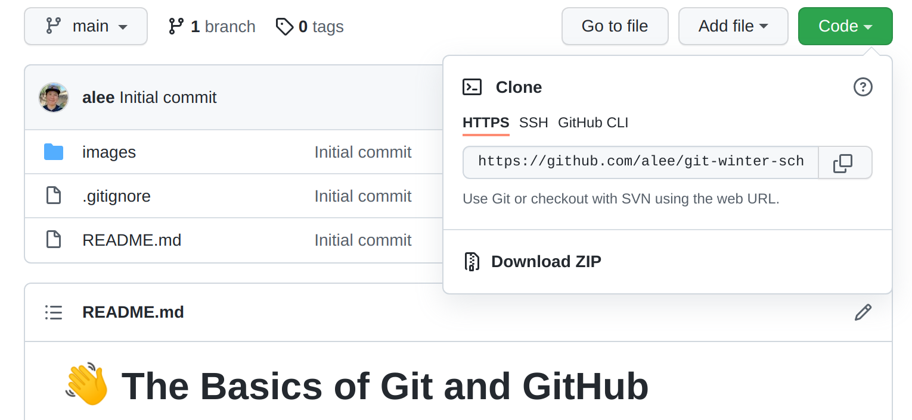
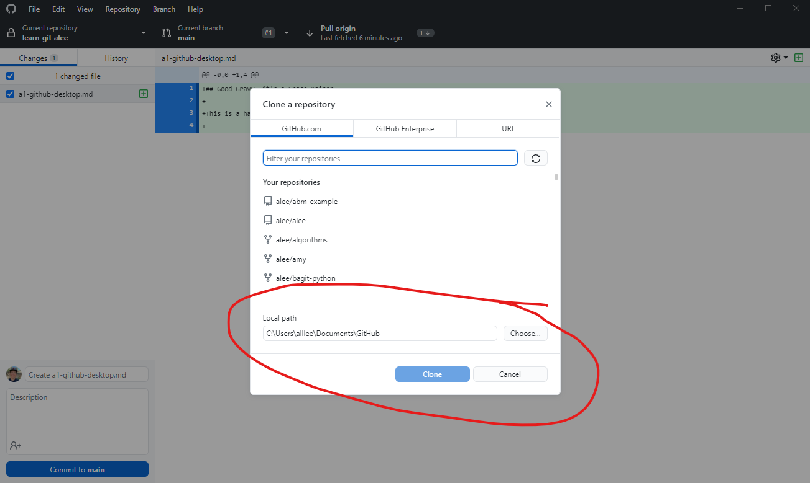
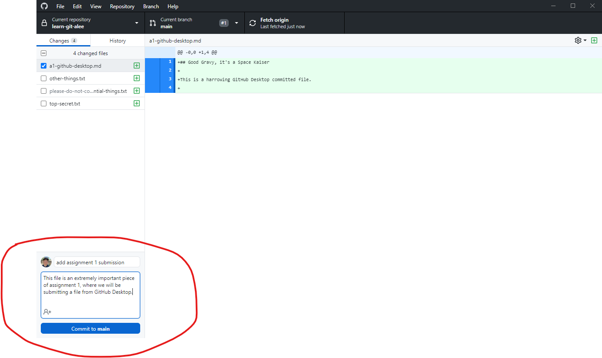
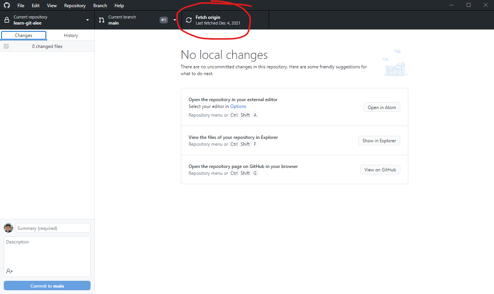
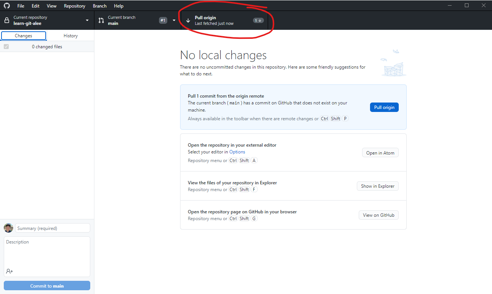
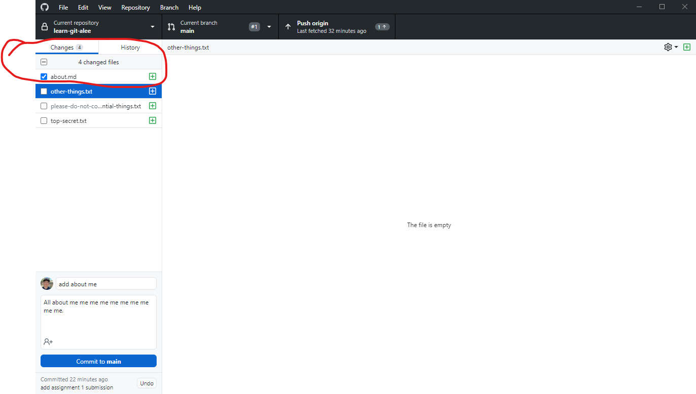

## CoMSES Winter School Homework

This file contains all of the homework assignments from the README for faster perusal.

### Assignment 0

Please clone this repository now. In GitHub Desktop, access the menu options `File -> Clone` repository (or <kbd>Ctrl</kbd> + <kbd>Shift</kbd> + <kbd>O</kbd> on Windows) and enter the URL from the Code button - it should be something like `https://github.com/comses/learn-git-<your-github-username>`

Take note of where your local Git repository is going to be saved, this is the `Local path` shown here:

### Assignment 1

There are three tasks in this assignment:

1. make changes to an existing file in this repository, `homework-edits.md`
2. add a new file with the GitHub web interface, named `add-github-web.md`
3. add a new file to your local repository using GitHub Desktop named `about.md`

The contents of these files should be valid GitHub markdown - experiment with the syntax and feel free to add any text you like. Your files should have at least the following types of Markdown content (across all of the files):

1. headers
2. a numbered list
3. a bulleted list
4. at least one hyperlink / URL to a web resource (whatever you like, something interesting to share with the rest of the class, but nothing inappropriate please!)

### Using Markdown on GitHub 

You might have noticed already, but you can add styling to your issues, pull requests, and files. ["Markdown"](https://guides.github.com/features/mastering-markdown/) is an easy way to style your issues, pull requests, and files with some simple syntax. This can be helpful to organize your information and make it easier for others to read. You can also drop in gifs, images, and emojis to help convey your ideas!

To learn more about using GitHub’s flavor of markdown, read ["Basic Writing and Formatting Syntax"](https://docs.github.com/en/github/writing-on-github/basic-writing-and-formatting-syntax). 

#### Edit an existing file

First, let's make some changes to a file that already exists in this repository. You should have already cloned this repository in [assignment 0](#assignment-0). Let's make modifications to the file, `homework-edits.md`, in this repository.

1. locate `homework-edits.md` on your local filesystem
2. open it in a text editor (e.g., Atom, VS Code)
3. make some changes to the file using valid Markdown and save them. Add a link to your work, write a poem. Feel free to be creative!

#### Record the commit

After making changes to the files it's time to return to GitHub Desktop to commit these changes. 

Enter a log summary and descriptive message to remind your future self and collaborators what you did and why.

Your log summary message should be short and to the point, an executive summary of the changes you made and typically limited to 50 characters. They are typically recorded in a present tense, action verb oriented style, e.g., `fix overflow bug in random number generator`.

The larger Description text box is the best place to include all relevant non-obvious details that would be difficult to glean from the code itself like an electronic lab notebook. It can be as long as needed.

When you are finished with your commit log messages and double checked that only the files you want to commit are checked in the window, click the "Commit" button.

Are these changes now visible on your repository at GitHub.com? Refresh the remote GitHub repository and see if the file is there.

The answer is no - we only recorded this change on our **local** Git repository. Our remote repository on GitHub is still unchanged and will remain so until we **push** our changes to GitHub.

Do that by clicking on the `Push origin` button shown here. Now when you refresh your GitHub repository you should see the changes there.

#### Create a new file: GitHub Web Interface

Create a new file through the GitHub web interface: https://docs.github.com/en/repositories/working-with-files/managing-files/creating-new-files

### Interlude: Fetch and Pull

#### synchronize your local repository with the remote GitHub web repository 

We just created a new file on our **remote** GitHub repository. But these changes do not exist on our local repository; GitHub Desktop is not like Dropbox and does not automatically synchronize.

To bring our **remote** changes over to our **local** GitHub repository we'll need to _fetch_ and _pull_ those changes in GitHub Desktop.

First, _fetch_ all changes from the **remote** GitHub repository by clicking this button on GitHub Desktop:

Fetch doesn't change the state of your actual filesystem, it just grabs all the changes that were made and updates the magic `.git` directory. You can verify this by going into your repository and check - is the file there?

In order to apply those changes to our actual filesystem, we need to *pull* them. You should see something like this:

Click on the `Pull origin` button to bring the new file that you *fetch*ed from your remote git repository into your local git repository into your active filesystem.

Remember to fetch and pull frequently, whenever you know there are remote changes that you need to pull into your local repository. It's a good idea to do it before every coding session and sometimes during your coding sessions as you coordinate with your team.

#### Create a new file: GitHub Desktop

Create a new file named `about.md` in your local repository folder. On Windows you can use the Repository menu item `Repository -> Show in Explorer` to go to your local repository folder. Once you've added some text to this file you will see it in your GitHub Desktop UI under the `Changes` tab. 

Check or uncheck the checkboxes to mark which files are to be included in this commit so be sure that you are _only including the files you want to commit_. By default GitHub Desktop checks all new files it finds in the GitHub repository folder that it is currently managing, so you might need to uncheck them if you don't want them getting sent to your remote GitHub repository. 

